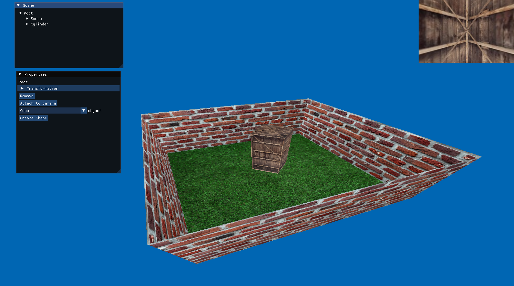
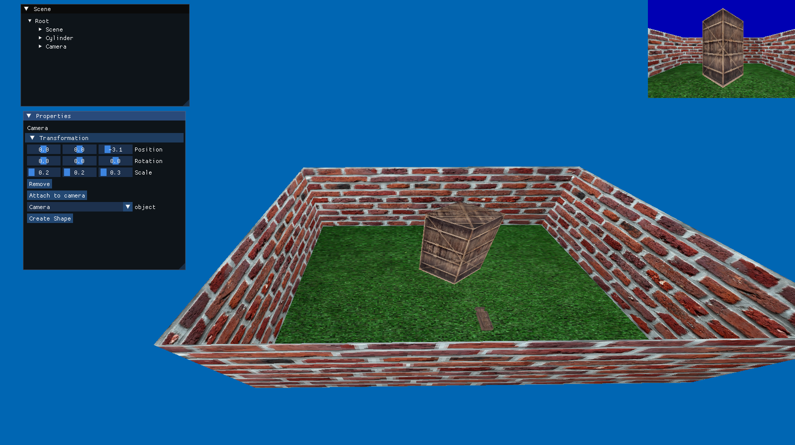
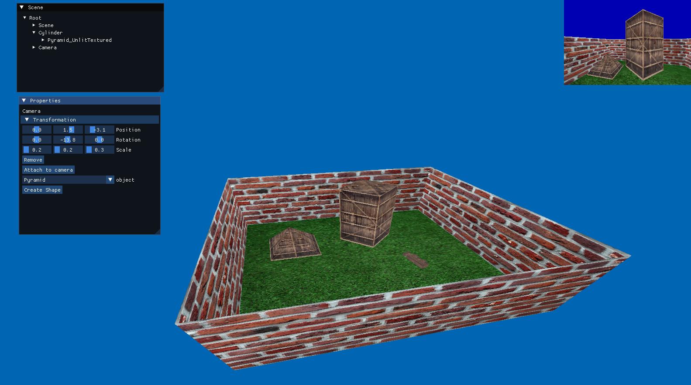

# 🌌 Computer Graphics Project 2


A modern, custom 3D graphics application built from scratch utilizing C++ and OpenGL. This project demonstrates core computer graphics concepts, a robust rendering pipeline, and real-time interactive systems.

## 🚀 Overview

In this project, I developed a custom 3D graphics application. The primary focus was to build a robust rendering pipeline from scratch, combining essential computer graphics concepts with clean software architecture. To achieve this, a structured system was designed featuring textured model loading, an interactive camera system, and a real-time graphical user interface.

## ✨ Key Features & Architecture

- 🎨 **Custom Rendering Pipeline:** Core rendering system using OpenGL and GLFW, handling shader compilation, buffer data management, and the efficient rendering of 3D meshes and complex textured models.
- 🎥 **Interactive Camera System:** Flexible, user-controlled camera architecture with responsive keyboard movement and mouse-based look mechanics for seamless real-time exploration.
- 🖥️ **GUI Integration & Multiple Viewports:** Integrated ImGui for a functional graphical user interface overlaid on the 3D scene, alongside support for rendering the environment through multiple distinct viewports simultaneously.
- 🏗️ **Clean C++ Architecture:** High maintainability and scalability utilizing a CMake-based build system, organizing source code, headers, shaders, and external dependencies (GLM, JSON) into a clear, modular structure.

## 📂 Project Structure

```text
📦 Computer-Graphics-Project-2
 ┣ 📂 src/              # C++ source files (.cpp)
 ┣ 📂 include/          # Header files (.hpp / .h)
 ┣ 📂 shaders/          # Vertex and Fragment shaders (.glsl)
 ┣ 📂 models/           # 3D model assets
 ┣ 📂 meshes/           # Mesh data
 ┣ 📂 images/           # Textures and image assets
 ┣ 📂 libraries/        # Dependencies (GLFW, GLM, ImGui, JSON)
 ┣ 📂 images-in-program/# Screenshots of the application
 ┗ 📜 README.md         # Project documentation
```

## 🛠️ Prerequisites

To build and run this project, you will need:
- **CMake** (version 3.5 or newer)
- **C++ Compiler** with C++17 support (e.g., MSVC, GCC, Clang)
- **Windows OS** (Current setup assumes a Windows environment)

## ⚙️ Build Instructions

This project uses CMake as its build system. To compile the project, run the following commands from the repository root:

```bash
# 1. Generate build files (using Ninja or your preferred generator)
cmake -S . -B build -G Ninja

# 2. Build the project
cmake --build build
```
*(If you are using Visual Studio, you can also open the folder directly as a CMake project.)*

## 🎮 Controls

Navigate the 3D scene with the following intuitive controls:
- **`W` / `A` / `S` / `D`**: Move the camera (Forward, Left, Backward, Right)
- **`Right Mouse Button` + `Drag`**: Rotate the camera view (Look around)

## 📸 Screenshots

Here are some previews of the rendering pipeline in action:

<p align="center">
  
  
  
</p>

## 🎓 Learning Outcomes

This project significantly improved my understanding of low-level graphics programming and the complete rendering pipeline within OpenGL. I gained practical experience in applying complex 3D mathematics using GLM, seamlessly integrating third-party libraries into a C++ environment, and structuring a robust codebase suitable for real-time graphics applications.
